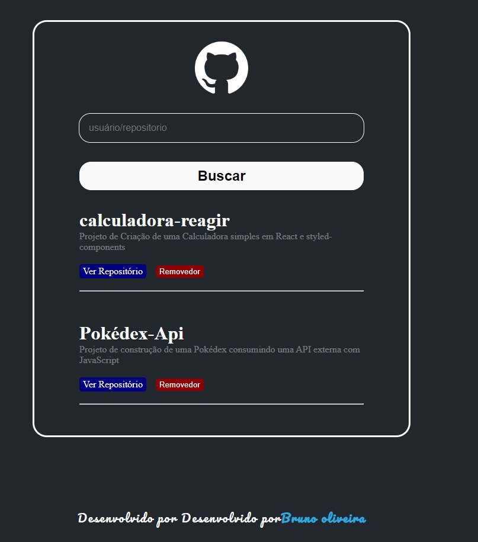

## 📌 Wiki de Repositórios do GitHub
Projeto de construção de uma wiki de repositórios do GitHub para realizar buscas de repositórios consumindo dados de uma API externa com React e Styled-components.

 

## 📎 Sumário
### ⭐ Features
### 📂 Temas abordados
### 🏆 Desafio
### 💻 Demonstração
### 🙋🏻‍♂️ Autor

 

## ⭐ Features
- Realizar consultas de repositórios do GitHub
- Opção de acessar o repositório via link
- Opção de excluir o repositório
- UI Responsiva

 

## 📂 Temas abordados
- Criação de componentes no React
- useState
- Styled-components
- Funções JavaScript(ES6)
- Fundamentos do CSS
- Responsividade
- Pseudo-elementos

 

## 🏆 Desafio
Aplicar os conhecimentos aprendidos em react, utilizando a criação de componentes, utilização de useState, arrows functions em JavaScript, consumo de API com funções assincronas e aplicação da biblioteca Styled-components do React.

 

## 💻 **Demonstração**
Você pode acessar ao resultado final do projeto <a href="https://wiki-repository-github.netlify.app/" target="_blank">Clicando aqui</a>.

 

## 🙋🏻‍♂️ Autor
Bruno Oliveira